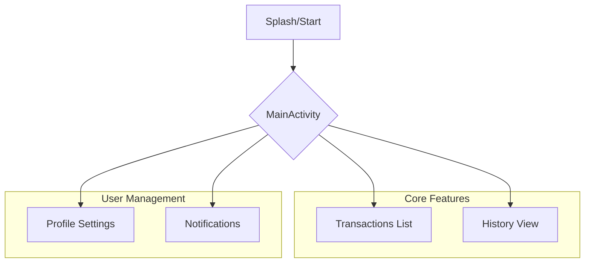

# 💳 Kwallet AY - Smart Digital Wallet


**Kwallet AY** is a sleek and modern digital wallet application designed to help users track their transactions, manage their balance, and handle their finances with a premium user interface.

---

## ✨ Features

- 💰 **Wallet Management**: Keep track of your total balance.
- 📜 **Transaction History**: Detailed list of recent activities with clear credit/debit indicators.
- 🔔 **Real-time Notifications**: Stay updated with your spending.
- 👤 **Profile Management**: Personalize your wallet experience.
- ⚙️ **Settings**: Customize the app to your liking.
- 📱 **Modern UI**: Built with Material Design and smooth navigation.

---

## 🛠 Tech Stack

- **Language**: [Kotlin](https://kotlinlang.org/)
- **UI Framework**: XML with [Material Components](https://material.io/develop/android)
- **Architecture**: MVVM (Planned/In-Progress)
- **Binding**: ViewBinding
- **Navigation**: [ChipNavigationBar](https://github.com/ismaeldivita/ChipNavigationBar)
- **Listings**: RecyclerView with Custom Adapters

---

## 📊 App Architecture & Flow



---

## 📸 Screenshots

| Home Screen | History | Profile |
|:---:|:---:|:---:|
|  |  |  |

> *Note: Replace these placeholders with actual screenshots from your device.*

---

## 🚀 Getting Started

### Prerequisites
- Android Studio Ladybug (or newer)
- Android SDK 36 (target)
- Minimum Android 8.0 (Oreo)

### Installation
1. Clone the repository:
   ```bash
   git clone https://github.com/yourusername/KwalletAY.git
   ```
2. Open the project in **Android Studio**.
3. Sync project with Gradle files.
4. Run the app on an emulator or physical device.

---

## 🤝 Contributing

Contributions are what make the open-source community such an amazing place to learn, inspire, and create. Any contributions you make are **greatly appreciated**.

1. Fork the Project
2. Create your Feature Branch (`git checkout -b feature/AmazingFeature`)
3. Commit your Changes (`git commit -m 'Add some AmazingFeature'`)
4. Push to the Branch (`git push origin feature/AmazingFeature`)
5. Open a Pull Request

---

## 📄 License

Distributed under the MIT License. See `LICENSE` for more information.

---

## 📧 Contact

**Ayush** - [Your Email/GitHub Profile]

Project Link: [https://github.com/yourusername/KwalletAY](https://github.com/yourusername/KwalletAY)

---
*Built with ❤️ by Ayush*
